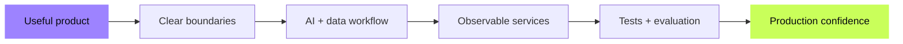

<div align="center">


<a href="https://git.io/typing-svg">
  
</a>

<p>
  
  
  
  
  
</p>

<p>
  <a href="https://www.linkedin.com/in/shrutilekkala/"></a>
  <a href="mailto:shrutilekkala@gmail.com"></a>
</p>

</div>

## About me

I'm **Shruti**, a software engineer who builds at the intersection of **AI, backend systems, and product engineering**.

I enjoy turning fuzzy ideas into dependable software: an interface people understand, an API that behaves predictably, an AI workflow that can be evaluated, and infrastructure that tells us when something goes wrong. My work spans agentic AI, LLM applications, distributed services, real-time products, data pipelines, and developer tooling.

```python
shruti = {
    "building": ["AI-native products", "distributed backends", "developer infrastructure"],
    "cares_about": ["reliability", "clear system boundaries", "useful interfaces"],
    "currently_exploring": ["agent evaluation", "MCP", "observable AI systems"],
    "open_to": "software and AI engineering opportunities",
}
```

## Tech constellation

<div align="center">

### Languages


### Product & backend


### Cloud, infrastructure & ML


</div>

<details>
<summary><b>More of my toolkit</b></summary>
<br>

`LLMs` · `RAG` · `MCP` · `Agent orchestration` · `Evaluation` · `Guardrails` · `gRPC` · `WebSockets` · `SSE` · `PySpark` · `Airflow` · `dbt` · `Snowflake` · `OpenTelemetry` · `Prometheus` · `Grafana`

</details>

## Selected builds

<table>
<tr>
<td width="50%" valign="top">

### ⚡ [SmartAdQuery](https://github.com/shrutilekkala/Smart-Ad-Query)

Ask advertising questions in plain English and receive grounded results with supporting rows, citations, confidence, and explicit limitations.

`React` `TypeScript` `FastAPI` `SQLite` `Docker`

</td>
<td width="50%" valign="top">

### 🔭 [FastAPI AI Telemetry](https://github.com/shrutilekkala/fastapi-ai-telemetry)

Privacy-conscious observability across request, retrieval, and model boundaries, designed to isolate failures rather than create new ones.

`Python` `FastAPI` `Prometheus` `ASGI` `Docker`

</td>
</tr>
<tr>
<td width="50%" valign="top">

### 🧠 [cppkv](https://github.com/shrutilekkala/distributed-key-value-store)

A multithreaded C++ key-value server exploring sharded locking, worker pools, TTL, persistence, crash recovery, and performance tradeoffs.

`C++17` `POSIX sockets` `Concurrency` `CMake`

</td>
<td width="50%" valign="top">

### 🛰️ [Collaborative Pinboard](https://github.com/shrutilekkala/realtime-collab-pinboard)

A real-time visual workspace that keeps concurrent clients synchronized through WebSockets and a durable backend.

`React` `FastAPI` `WebSockets` `PostgreSQL` `Redis`

</td>
</tr>
</table>

<div align="center">
  <a href="https://github.com/shrutilekkala?tab=repositories"><b>Explore all repositories →</b></a>
</div>

## How I build



- Start with the user decision, not the trendiest framework.
- Define retries, fallbacks, approvals, and recovery as part of the design.
- Evaluate the full path: retrieval, model output, latency, cost, and operations.
- Leave behind reproducible setup, tests, and honest technical tradeoffs.

<div align="center">

### Let’s build something useful.

<i>AI systems should be impressive under real constraints—not only in a demo.</i>

<br><br>


</div>
