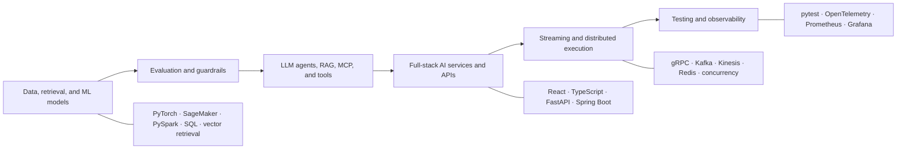

# Shruti Lekkala

### Full-Stack AI Engineer building LLM, agentic, and distributed systems

I design and ship end-to-end AI products—from React and TypeScript interfaces to APIs, RAG, MCP tool calling, agent orchestration, data and ML pipelines, cloud infrastructure, evaluation, and production observability.

[Portfolio](https://shruti-lekkala-portfolio.vercel.app) · [Repositories](https://github.com/shrutilekkala?tab=repositories)

## What I build

- **Full-stack AI products:** React and TypeScript interfaces, FastAPI and Spring Boot services, streaming workflows, databases, and cloud deployment
- **LLM and agentic systems:** RAG, embeddings, MCP, tool calling, structured outputs, agent orchestration, evaluation, guardrails, and human approval
- **Distributed backend systems:** REST and gRPC APIs, concurrency, Kafka and Kinesis streams, Redis caching, persistence, recovery, and failure isolation
- **Production AI infrastructure:** model and data pipelines, Docker, Kubernetes, Terraform, CI/CD, tracing, metrics, privacy boundaries, and reliability engineering

## Engineering path

## Selected systems

These repositories emphasize inspectable engineering evidence: source code, automated tests, explicit failure behavior, reproducible setup, and measured tradeoffs.

<table>
<tr>
<td width="50%" valign="top">

### [cppkv](https://github.com/shrutilekkala/distributed-key-value-store)

Multithreaded C++17 key-value server with 16-way sharded locking, a fixed worker pool, TTL, write-ahead persistence, crash recovery, tests, and reproducible benchmarks.

`C++` `POSIX sockets` `Concurrency` `CMake`

**Focus:** locking, durability, protocol design, and performance tradeoffs

</td>
<td width="50%" valign="top">

### [FastAPI AI Telemetry](https://github.com/shrutilekkala/fastapi-ai-telemetry)

Privacy-safe request and model-call observability middleware with structured traces, Prometheus metrics, failure isolation, tests, and a non-root container.

`Python` `FastAPI` `Prometheus` `ASGI` `Docker`

**Focus:** AI infrastructure, telemetry boundaries, privacy, and reliability

</td>
</tr>
<tr>
<td width="50%" valign="top">

### [Real-Time Collaborative Pinboard](https://github.com/shrutilekkala/realtime-collab-pinboard)

Collaborative board with WebSocket synchronization across a React frontend and FastAPI backend, backed by PostgreSQL and Redis.

`React` `FastAPI` `WebSockets` `PostgreSQL` `Redis`

**Focus:** real-time state, concurrent clients, and full-stack integration

</td>
<td width="50%" valign="top">

### [SmartAdQuery](https://github.com/shrutilekkala/Smart-Ad-Query)

Natural-language advertising analytics application that turns campaign questions into safe, grounded results with supporting rows, citations, confidence, and explicit limitations.

`React` `TypeScript` `FastAPI` `SQLite` `Docker`

**Focus:** applied AI interfaces, safe query execution, grounded analytics, and product engineering

</td>
</tr>
</table>

## Technical toolkit

| Area | Tools and concepts |
|---|---|
| **Languages** | Python, Java, C++, TypeScript, JavaScript, SQL |
| **AI and ML** | LLMs, RAG, MCP, tool calling, agent orchestration, evaluation, guardrails, PyTorch, LoRA/PEFT, embeddings, NLP |
| **Backend systems** | FastAPI, Spring Boot, RESTful APIs, gRPC, WebSockets, SSE, Kafka, Redis, AsyncIO, concurrency |
| **Data platforms** | PySpark, Airflow, dbt, PostgreSQL, Snowflake, vector retrieval |
| **Infrastructure** | AWS, Azure, GCP, Docker, Kubernetes, Terraform, GitHub Actions, CI/CD, OpenTelemetry, Prometheus, Grafana |

## How I approach systems

1. Define failure behavior before optimizing the happy path.
2. Validate models, agents, and APIs with repeatable regression tests.
3. Make request, retrieval, model, retry, and recovery boundaries observable.
4. Document architecture decisions and the tradeoffs behind them.
5. Keep setup, test commands, benchmark methodology, and limitations reproducible.

**Current focus:** full-stack agentic AI, reliable LLM systems, distributed execution, evaluation, and production observability.

