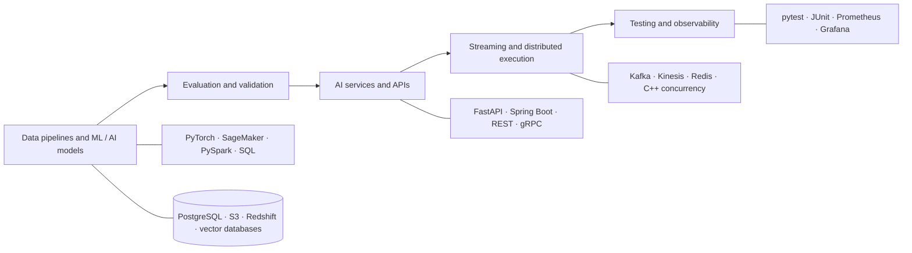

# Shruti Lekkala

### Software Engineer building full-stack products, AI/ML systems, distributed platforms, and backend infrastructure

I build end-to-end systems across user interfaces, APIs, data and ML pipelines, distributed services, cloud infrastructure, observability, and production reliability.

[Portfolio](https://shruti-lekkala-portfolio.vercel.app) · [Repositories](https://github.com/shrutilekkala?tab=repositories)

## Engineering focus

- **ML and AI systems:** training, evaluation, RAG, agent workflows, model serving, and failure-aware orchestration
- **Backend and distributed systems:** APIs, RPC, concurrency, caching, streaming, persistence, and recovery
- **Data and platform engineering:** reproducible pipelines, containers, Kubernetes, cloud infrastructure, and observability
- **Product engineering:** React and TypeScript interfaces for real-time data and AI workflows

## Selected systems

These repositories emphasize inspectable engineering evidence: source code, automated tests, explicit failure behavior, reproducible setup, and measured tradeoffs.

<table>
<tr>
<td width="50%" valign="top">

### [cppkv](https://github.com/shrutilekkala/distributed-key-value-store)

Multithreaded C++17 key-value server with 16-way sharded locking, a fixed worker pool, TTL, write-ahead persistence, crash recovery, tests, and reproducible benchmarks.

`C++` `POSIX sockets` `Concurrency` `CMake`

**Focus:** locking, durability, protocol design, and performance tradeoffs

</td>
<td width="50%" valign="top">

### [FastAPI AI Telemetry](https://github.com/shrutilekkala/fastapi-ai-telemetry)

Privacy-safe request and model-call observability middleware with structured traces, Prometheus metrics, failure isolation, tests, and a non-root container.

`Python` `FastAPI` `Prometheus` `ASGI` `Docker`

**Focus:** AI infrastructure, telemetry boundaries, privacy, and reliability

</td>
</tr>
<tr>
<td width="50%" valign="top">

### [Real-Time Collaborative Pinboard](https://github.com/shrutilekkala/realtime-collab-pinboard)

Collaborative board with WebSocket synchronization across a React frontend and FastAPI backend, backed by PostgreSQL and Redis.

`React` `FastAPI` `WebSockets` `PostgreSQL` `Redis`

**Focus:** real-time state, concurrent clients, and full-stack integration

</td>
<td width="50%" valign="top">

### [SmartAdQuery](https://github.com/shrutilekkala/Smart-Ad-Query)

Natural-language advertising analytics application that turns campaign questions into safe, grounded results with supporting rows, citations, confidence, and explicit limitations.

`React` `TypeScript` `FastAPI` `SQLite` `Docker`

**Focus:** applied AI interfaces, safe query execution, grounded analytics, and product engineering

</td>
</tr>
</table>

## Technical toolkit

| Area | Tools and concepts |
|---|---|
| **Languages** | Python, Java, C++, TypeScript, JavaScript, SQL |
| **AI and ML** | PyTorch, LLM evaluation, RAG, MCP, LoRA/PEFT, embeddings, NLP, time series |
| **Backend systems** | FastAPI, Spring Boot, RESTful APIs, gRPC, Kafka, Redis, AsyncIO, concurrency |
| **Data platforms** | PySpark, Airflow, dbt, PostgreSQL, Snowflake, vector retrieval |
| **Infrastructure** | AWS, Azure, GCP, Docker, Kubernetes, Terraform, CI/CD, Prometheus, Grafana |

## How I approach systems

1. Define failure behavior before optimizing the happy path.
2. Validate models, agents, and APIs with repeatable regression tests.
3. Make request, retrieval, model, retry, and recovery boundaries observable.
4. Document architecture decisions and the tradeoffs behind them.
5. Keep setup, test commands, benchmark methodology, and limitations reproducible.

**Current focus:** reliable AI platforms, distributed execution, evaluation, and production observability.

