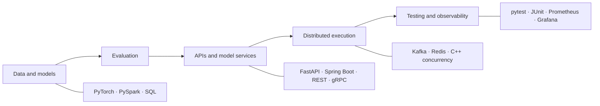

# Shruti Lekkala

### Software Engineer building ML systems, distributed backends, and AI infrastructure

I work across the path from models and data to APIs, concurrent runtimes, observability, and production reliability.

## Engineering focus

- **ML and AI systems:** training, evaluation, RAG, agent workflows, model serving, and failure-aware orchestration
- **Backend and distributed systems:** APIs, RPC, concurrency, caching, streaming, persistence, and recovery
- **Data and platform engineering:** reproducible pipelines, containers, Kubernetes, cloud infrastructure, and observability
- **Product engineering:** React and TypeScript interfaces for real-time data and AI workflows

## Selected systems

<table>
<tr>
<td width="50%" valign="top">

### [cppkv](https://github.com/shrutilekkala/distributed-key-value-store)

Multithreaded C++17 key-value server with 16-way sharded locking, a fixed worker pool, TTL, write-ahead persistence, crash recovery, tests, and reproducible benchmarks.

`C++` `POSIX sockets` `Concurrency` `CMake`

**Focus:** locking, durability, protocol design, and performance tradeoffs

</td>
<td width="50%" valign="top">

### [Real-Time Collaborative Pinboard](https://github.com/shrutilekkala/realtime-collab-pinboard)

Collaborative board with WebSocket synchronization across a React frontend and FastAPI backend, backed by PostgreSQL and Redis.

`React` `FastAPI` `WebSockets` `PostgreSQL` `Redis`

**Focus:** real-time state, concurrent clients, and full-stack integration

</td>
</tr>
<tr>
<td width="50%" valign="top">

### [Cancer Survival Explorer](https://github.com/shrutilekkala/statistical-genomics-explorer)

Reproducible survival-analysis system using public TCGA-PAAD data, Kaplan-Meier analysis, log-rank testing, and multivariate Cox modeling.

`Python` `Survival analysis` `Bioinformatics`

**Focus:** reproducible research, statistical validation, and transparent data boundaries

</td>
<td width="50%" valign="top">

### [Brain scRNA-seq Explorer](https://github.com/shrutilekkala/brain-scrna-explorer)

Single-cell ML pipeline covering quality control, normalization, PCA, clustering, marker detection, automated annotation, and interactive exploration.

`Python` `scikit-learn` `PCA` `Clustering`

**Focus:** end-to-end ML pipelines and interpretable analysis

</td>
</tr>
</table>

## Technical toolkit

| Area | Tools and concepts |
|---|---|
| **Languages** | Python, Java, C++, TypeScript, JavaScript, SQL |
| **AI and ML** | PyTorch, LLM evaluation, RAG, MCP, LoRA/PEFT, embeddings, NLP, time series |
| **Backend systems** | FastAPI, Spring Boot, RESTful APIs, gRPC, Kafka, Redis, AsyncIO, concurrency |
| **Data platforms** | PySpark, Airflow, dbt, PostgreSQL, Snowflake, vector retrieval |
| **Infrastructure** | AWS, Azure, GCP, Docker, Kubernetes, Terraform, CI/CD, Prometheus, Grafana |

## How I approach systems

1. Define failure behavior before optimizing the happy path.
2. Validate models, agents, and APIs with repeatable regression tests.
3. Make request, retrieval, model, retry, and recovery boundaries observable.
4. Document architecture decisions and the tradeoffs behind them.
5. Keep setup, test commands, benchmark methodology, and limitations reproducible.

**Current focus:** reliable AI platforms, distributed execution, evaluation, and production observability.

